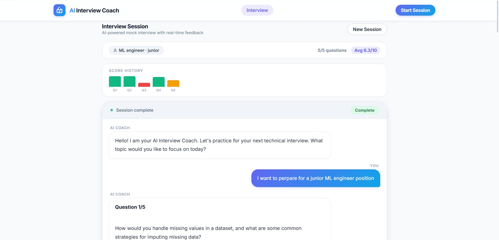
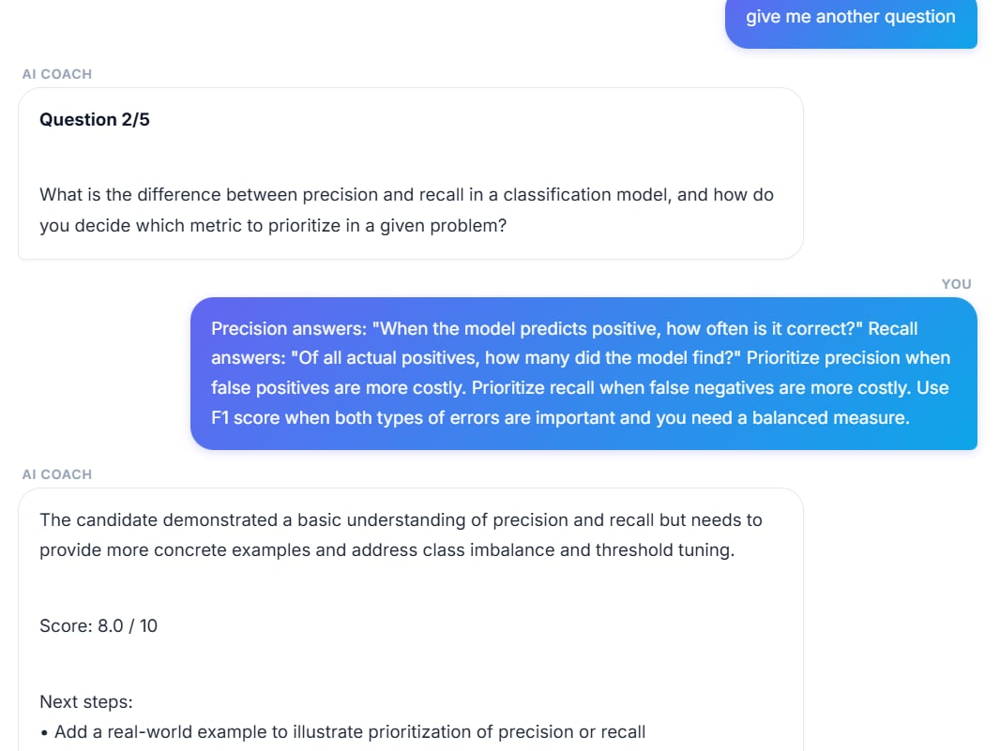

# AI Interview Coach

> A production-style multi-agent AI system that conducts realistic technical and behavioral interviews, evaluates answers across multiple dimensions, and streams real-time feedback.

This system demonstrates end-to-end AI system design using a 9-agent LangGraph pipeline, FastAPI backend, React frontend, hybrid retrieval caching (Redis + ChromaDB), and an evaluation suite powered by DeepEval.

---

# Why This Project

Most interview preparation tools fall into one of two categories:

- Static question banks with no intelligence
- Single LLM calls with no memory, routing, or evaluation structure

This project explores what happens when interview simulation is designed as a **stateful multi-agent system**, closer to a production AI pipeline than a prompt demo.

It focuses on:

- Multi-agent orchestration (LangGraph)
- Stateful reasoning across sessions
- Retrieval-augmented grounding (Tavily + cache)
- Cost/latency optimization via model routing
- Evaluation-driven AI behavior (LLM-as-judge)

---

## Screenshots





---

# Key Features

## Multi-Agent Intelligence

A structured 9-agent LangGraph pipeline:

```
guardrail → ambiguity → profile_merge → router → technical / behavioral → evaluation → fusion → report
```

Each agent is isolated, testable, and independently model-routed.

---

## Real-Time Streaming (SSE)

- Token-by-token generation
- Low-latency interview experience
- Built with Server-Sent Events (SSE)
- Smooth UX for long-form answers

---

## Hybrid Memory & Retrieval System

- Redis → session memory + exact cache
- ChromaDB → semantic cache (HNSW indexing)
- Tavily → live web search grounding

This enables both **fast repeated queries** and **semantic reuse of similar queries**.

---

## Evaluation Engine (DeepEval)

Multi-dimensional evaluation using LLM-as-judge:

- Answer Relevancy
- Correctness (GEval)
- Faithfulness

Used as a regression suite to validate pipeline behavior.

---

## Cost-Aware Model Routing

| Task | Model |
|------|-------|
| Guardrails / Routing | llama-3.1-8b |
| Question Generation | llama-3.3-70b |
| Evaluation / Fusion | GPT-OSS-120B |

This balances cost, speed, and reasoning quality.

---

# System Architecture

```
Frontend (React + Vite)
│
│ SSE / HTTP
▼
FastAPI Backend
│
▼
LangGraph Multi-Agent System
│
┌──────┴──────────────┐
▼                     ▼
Redis + ChromaDB      LLM Gateway (Groq)
                      │
                      ▼
                 Tavily Search


---

# Agent Responsibilities

| Agent | Responsibility |
|-------|----------------|
| Guardrail | Input validation & safety filtering |
| Ambiguity | Extract role, level, missing context |
| Profile Merge | Maintains session state |
| Router | Chooses technical vs behavioral path |
| Technical | Generates/evaluates technical questions |
| Behavioral | STAR-based behavioral evaluation |
| Evaluation | Multi-axis scoring |
| Fusion | Aggregates final structured result |
| Report | Generates final markdown report |

---

# Tech Stack

## Backend

- FastAPI + Uvicorn
- LangGraph + LangChain
- Groq (Llama 3.1 / 3.3 / GPT-OSS-120B)
- Redis (sessions + cache)
- ChromaDB (vector cache)
- Tavily API
- Pydantic v2

## Frontend

- React 18 + Vite + TypeScript
- React Router
- Custom SSE streaming UI

## Infrastructure

- Docker Compose (Redis + ChromaDB)
- DeepEval regression testing
- ONNX MiniLM embeddings

---

# Getting Started

## 1. Clone repository

```bash
git clone https://github.com/<your-username>/ai-interview-coach.git
cd ai-interview-coach
cp .env.example .env
```

## 2. Start infrastructure

```bash
docker compose up -d
```

## 3. Run backend

```bash
python -m venv .venv
.venv\Scripts\activate
pip install -r requirements.txt
uvicorn api.main:app --reload --port 8002
```

API Docs: http://localhost:8002/docs

## 4. Run frontend

```bash
cd frontend
npm install
npm run dev
```

Frontend: http://localhost:5173

---

# API Overview

| Endpoint | Description |
|----------|-------------|
| `/interview` | Full multi-agent interview pipeline |
| `/chat/stream` | SSE token streaming |
| `/search` | Hybrid cached search |
| `/interview/reset` | Reset session state |

---

# Project Structure

```
agents/        → LangGraph nodes
graph/         → Pipeline definition
services/      → LLM, cache, session, search
api/           → FastAPI routes
frontend/      → React UI
schemas/       → Pydantic models
tests/         → DeepEval suite
utils/         → logging + JSON repair
```

---

# Evaluation

DeepEval regression suite:

- Answer Relevancy
- Correctness (GEval)
- Faithfulness

| Session | Task | Result |
|---------|------|--------|
| pipe-001 | ML system design | strong |
| pipe-002 | URL shortener | medium |
| off-001 | baseline | controlled |

Full evaluation details: [DECISIONS.md](DECISIONS.md)

---

# Design Decisions

All architecture reasoning, trade-offs, benchmarks, and failures are documented here:

[DECISIONS.md](DECISIONS.md)

Includes:

- Why LangGraph multi-agent design
- Hybrid Redis + ChromaDB cache
- SSE vs WebSockets
- Model routing strategy
- System failures and fixes

---

# Author

**Hiba Chabbouh** — Software Engineering Student @ INSAT

Interests: MLOps, Generative AI, LLM Systems, Data Engineering
